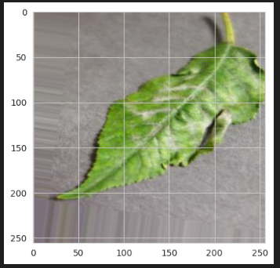
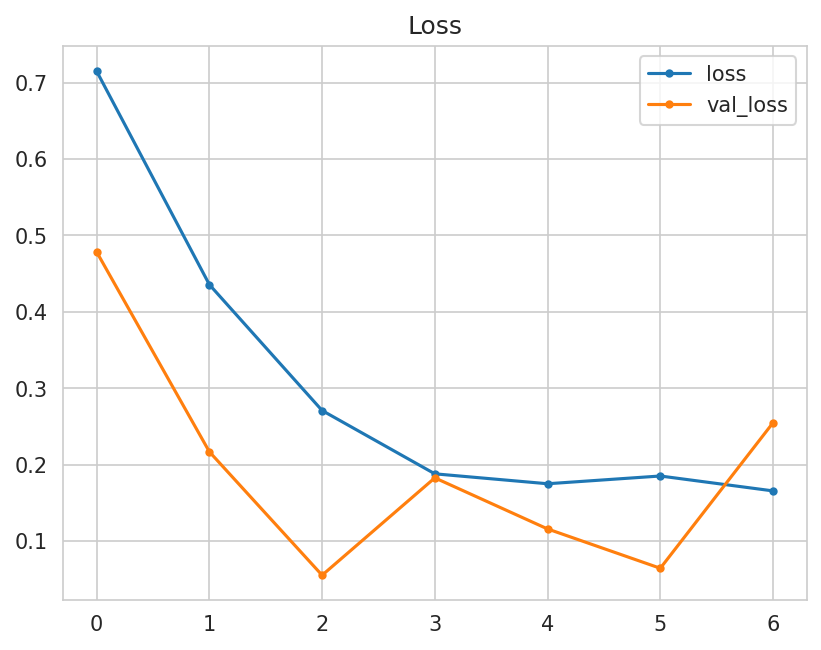
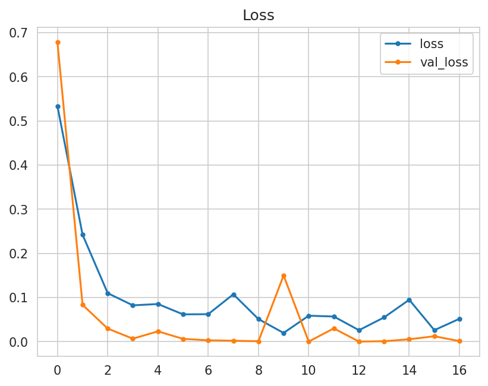

# Mildew Detection in Cherry Leaves

The goal of this project is to visually differentiate between healthy cherry leaves and those affected by powdery mildew. The project is available for live viewing on the [Streamlit Dashboard](https://pp5-mildew-cherry-leaf-ecc22555c3b8.herokuapp.com/), where users can read more about the project and upload new images to test the model's performance.

The dashboard displays the results of the data analysis, a description and evaluation of the project's hypotheses, and detailed performance metrics of the machine learning model.

The project includes a series of Jupyter Notebooks that create a pipeline for data import, cleaning, visualization, and the development and evaluation of a deep learning model.

## Table of Contents
1. [Dataset Content](#dataset-content)
2. [Business Requirements](#business-requirements)
3. [Hypothesis and Validation](#hypothesis-and-how-to-validate)
4. [The rationale to map the business requirements](#the-rationale-to-map-the-business-requirements)
5. [ML Business Case](#ml-business-case)
6. [ML Model Development](#ml-model-development)
7. [Dashboard Design](#dashboard-design)
8. [Unfixed Bugs](#unfixed-bugs)

## Dataset Content

- The dataset used for this project is supplied by Code Institute and sourced from [Kaggle](https://www.kaggle.com/codeinstitute/cherry-leaves).
- The dataset contains +4 thousand images taken from the client's crop fields where 50% of these images were utilised for the model training, validating and testing prcess. The images show healthy cherry leaves and cherry leaves that have powdery mildew, a fungal disease that affects many plant species. The cherry plantation crop is one of the finest products in their portfolio, and the company is concerned about supplying the market with a compromised quality product.

1. The data was gathered from kaggle consisting of 4208 images of healthy and powdery-mildew cherry leaves. 50% of these images were removed before splitting them into train, test and validtation folders. Non-image files were also removed.
2. The dataset was split into a ratio of the training set - 70% of the data, the validation set - 10% of the data and the test set - 20% of the data. Total images were 2104.
3. Images were all checked/resized to 256px width & 256px height to ensure consistancy throghout the dataset.
    

    
Image Dimensions

    
    

4. The count of images in each folder were as follows: 
    - Train - Healthy: 736 images
    - Train - Powdery Mildew: 736 images
    - Validation - Healthy: 105 images
    - Validation - Powdery Mildew: 105 images
    - Test - Healthy: 211 images
    - Test - Powdery Mildew: 211 images
    

    
Image Count per Label

    
    

5. Images were augmented to artificially expand the training and test dataset by creating modified versions of images already available to help improve model generalization, reduce the possibility of overfitting, and enhance the model's ability to recognize patterns in varied scenarios.
    

    
Augmented Images

    
    
    

## Business Requirements

The cherry plantation crop from Farmy & Foods is facing a challenge where their cherry plantations have been presenting powdery mildew. Currently, the process is manual verification if a given cherry tree contains powdery mildew. An employee spends around 30 minutes in each tree, taking a few samples of tree leaves and verifying visually if the leaf tree is healthy or has powdery mildew. If there is powdery mildew, the employee applies a specific compound to kill the fungus. The time spent applying this compound is 1 minute. The company has thousands of cherry trees located on multiple farms across the country. As a result, this manual process is not scalable due to the time spent in the manual process inspection.

To save time in this process, the IT team suggested an ML system that detects instantly, using a leaf tree image, if it is healthy or has powdery mildew. A similar manual process is in place for other crops for detecting pests, and if this initiative is successful, there is a realistic chance to replicate this project for all other crops. The dataset is a collection of cherry leaf images provided by Farmy & Foods, taken from their crops.

1. The client is interested in conducting a study to visually differentiate a healthy cherry leaf from one with powdery mildew.
2. The client is interested in predicting if a cherry leaf is healthy or contains powdery mildew.
3. The client is interested in having the option to download a prediction report for the examined leaves.
4. It was agreed with the client to attain an accuracy rate of 97%.

## Hypothesis and how to validate?

Hypothesis: The machine learning model can accurately predict with the use of images whether a cherry leaf is healthy or contains powdery mildew based on its features

Validation: By following a systematic approach that includes data preparation, model training, and evaluation of healthy cherry leaves images and those that contain powdery mildew. 

Cherry leaves containing powdery mildew can be distinguished from healthy leaves by their appearance. This is verified by creating an average image study and an image montage to determine the differences in the appearance of both contaminated leaves and healthy leaves.
Contaminated leaves and healthy leaves can be determined with a 97% accuracy, this will be verified by evaluating the model on the test dataset, which achieves 99% accuracy%.

## The rationale to map the business requirements

### Business requirements:
- Differentiate Healthy and Powdery mildew Cherry Leaves: The main goal is to correctly identify whether cherry leaves are healthy or affected by powdery mildew.
- High Accuracy: Meet the client's requirement by ensuring the model achieves an accuracy of at least 97%.
- Prediction Report: Provide an option for clients to download prediction reports of the examined leaves.

### Epics:
1. Information Gathering and Data Collection: 
    - The importation of the cherry leaf image dataset from Kaggle.
2. Data Visualization, Cleaning, and Preparation:
    - Data cleaning to identify and correct errors or inconsistencies in the dataset to improve its quality, data preparation to transform raw data into a format more suitable for analysis and visualisation to graphically represent the data to uncover patterns, trends, and insights.
3. Model Training, Optimization, and Validation:
    - To teach the model to recognise patterns from the training set, improve the model's performance by tuning its parameters and adjusting its algorithms and validate by testing the model on new data to ensure it generalises the new data well and performs accurately on the unseen data.
4. Dashboard Planning, Designing, and Development:
    - To ensure that the dashboard is useful, user-friendly, and effective in communicating data insights to facilitate informed decision-making.
5. Dashboard Deployment and Release: 
    - To ensure that the dashboard is easily accessible and functional for the end-user to utilise for decision-making.

### User Stories/Tasks:
Information Gathering and Data Collection: 
 - User Story: As a data analyst/developer, I can gather all relevant data about cherry leaves, including images of both healthy and powdery mildew leaves, so that I can use this dataset for analysis and model training.
    - Task: Gather and download quality images from Kaggle, label and organize them, and document the process.  

Data Visualization, Cleaning, and Preparation:
 - User Story: As a data analyst/developer, I can clean the images collected in the dataset by removing or correcting errors, duplicates or irrelevant images so that I can have a good high quality dataset that imporves the perfomance of the model.
 - User Story: As a data analyst/developer, I need to prepare the dataset for the model training process so that I can make sure it is in the correct format and structure for the best results.
 - User Story: As a data analyst/developer, I need to visualise the data so that I can visually understand the dataset.
     - Task: Check the dataset for non-image files & reomove, correct any labels and remove duplicates.
     - Task: Remove excess images (50%), create sub-folders (train, test & validation) and split the data into relevant folders with the correct ratios.
     - Task: Plot the class distribution and display and save sample & average images, create an image montage on the two labels.

Model Training, Optimization, and Validation:
 - User Story: As a data analyst/developer, I need to train a deep learning on the newly prepared dataset so that I can accurately differentiate between healthy and powdery mildew cherry leaves.
 - User Story: As a data analyst/developer, I need to optimise the model so that I can get at least the minimum required accuracy and performance.
 - User Story: As a data analyst/developer, I need to validate the model so that I can make sure it generalises on unseen data.
     - Task: Create and train a CNN with multiple layers.
     - Task: Optimize hyperparameters to achieve a minimum accuracy of 97%, adjust batch size, epoches.
     - Task: Evaluate the model's performance using the test data.

Dashboard Planning, Designing, and Development:
 - User Story: As a data analyst/developer, I need to plan the dashboard features so that I can make sure it meets the client's needs and business requirments.
 - User Story: As a data analyst/developer, I need to design a user friendly dashboard so that a user can easily navigate and understand the features.
 - User Story: As a data analyst/developer, I need to develop the dashboard inline with the design specs so that it works as it is meant to.
     - Task: Implement features as agreed, test and debug.
     - Task: Gather and understand requirments to meet the client's needs.
     - Task: Must be visually appealing, user friendly, responsive and accissible of varius devices.

Dashboard Deployment and Release: 
 - User Story: As a data analyst/developer, I need to prepare & deploy the dashboard so that  users can access and make use of it no problems or setbacks. 
     - Task: Review and optimise code, prepare, configure environments & deploy.

## ML Business Case

1. Business Objective
    - Objective: By using an ML model we will solve the problem of differentiating between heathly and powdery mildew cherry leaves saving Farmy & Foods many hours of labour used for the current manual process.
    - Business impact: To improve Farmy & Foods crop current health monitoring porcess, leading to reduced crop losses and maintaining the highest customer satisfaction.
2. Business Problem
    - Description & Challenges: Farmy & Foods is currently spending many hours of manual inspection is time-consuming and prone to errors when trying to identify cherry leaves affected with powdery mildew, leading to ineffective treatments and crop losses.
    - Goals: To make use of an ML model to automatically and accurately identify cherry leaves affected with powdery mildew with at least 97% accuracy.
3. Proposed Solution
    - ML Approach: A Convolutional Neural Network (CNN) model will be developped to classify between healthy and affected with powdery mildew leaf images.
    - Data Requirements: An image data set consisting of images of both healthy and affected with powdery mildew leaves.
4. Business Value
    - By using this model, we expect to quickly and accurately detect affected crops, allowing for early treatments, healthier plants and satisfied customers. Success will be measured by the models accuracy and how well works in detecting affected leaves. The benefits will include fewer crop losses and better quality harvests.
5. Risk Mitigation
    - Data Quality: Use strong methods to collect and prepare image data, including adding variety and checking quality, to ensure the dataset is diverse and of high-quality.
    - Model Performance: The model might not reach the requireed accuracy, so it will be refined by using cross-validation and repeated testing.
    - User: Users might resist the new system. To help, the dashboard withh be user friendly and simple to use and understand, detailed guides, support, and explanations are available.
    - Data privacy: NDAs and ethical guidelines will be followed to keep cherry leaf images and related data confidential and secure.
6. Implementation Plan
    - Data collection & processing 
    - Model development & training 
    - Model evaluation, testing, optimization and deployment

## ML Model Development

### Final Model - v7
The final model used (v7) is a Convolutional Neural Network (CNN) for classifying images into two categories. It has five convolutional layers with max-pooling, followed by a flattening layer and a dense layer. The dropout layer helps prevent overfitting. The final layer uses a sigmoid activation for binary classification. The model uses binary cross-entropy loss and is optimized with Stochastic Gradient Descent (SGD).

Final Model

5 layers were created to detect, extract & capture features in the images, higher filters were then set for deeper feature extraction and pattern capturing. All 5 layers were set to a 3x3 kernel.
1. Convolutional Layers: 
    - First Layer: Uses 16 filters
    - Second Layer: Uses 32 filters
    - Third Layer: Uses 64 filters 
    - Fourth Layer: Uses 128 filters
2. Max-Pooling Layers:
    - Max-pooling is applied after each convolutional layer reducing the size of the feature maps, keeping the essential information and making computation easier.
3. Flatten Layer:
    - The flatten layer is applied to convert the 2D feature maps from the convolutional layers into a 1D vector to feed into the dense layers.
4. Dense Layers:
    - First Layer: Contains 128 neurons that use ReLU activation to learn patterns from the data.
    - Dropout Layer: Turns off 50% of the neurons randomly during training to prevent overfitting.
    - Output Layer: Contains 1 neuron that uses sigmoid activation to give a probability for binary classification.
5. Compilation:
    - Loss: Uses binary cross-entropy to measure how well the model performs on binary classification.
    - Optimizer: Uses Stochastic Gradient Descent (SGD) to adjust the model's parameters and reduce errors.
    - Metrica: Measures how accurate the model's predictions are.
- Model Performance:
    

    
Loss

    
    

    

    
Accuracy

    
    

    

    
ROC Curve

    - Both the training and validation losses decrease and stabilize at low values, indicating that the model has converged; the high training and validation accuracies show the model is performing well; and the close alignment between the training and validation metrics indicates the model is not overfitting and can generalize well on new data.

    
    

    

    
Confusion Matrix

    - The model correctly identified 210 healthy and 209 powdery mildew instances, with 3 errors: 1 healthy instance misclassified as powdery mildew and 2 powdery mildew instances misclassified as healthy.

    
    

    

    
Classification Report

    - The model performs exceptionally well, with high precision, recall, and F1-scores for both classes, and an overall accuracy of 99%.

    
    

### Other Versions - Trial and Error
When creating the model I wanted to strive for the best possible results, but had some under and over fitting to begin with. I tried adam and SBD as optimisers and founf that SGD was giviong me the best overall results so this was sued for the final model. The first model also started off with 3 convolutional layers, 2 more were added to get to the final results. Filters were amended for enhanced feature detection and improved accuracy. Additional plots were also added to assist with a better understanding of how the model was performing.

v1

v2

v3

v4

v5

v6

## Dashboard Design 

### Streamlit App User Interface.

### Page 1: Quick Project Summary
- General Information:
    - Powdery mildew caused by Podosphaera clandestina affects cherry trees. It appears as a white or grayish powder on leaves, causing curling, yellowing, and premature leaf drop. The disease thrives in warm, dry conditions with poor air circulation.
    - Management includes improving air flow through pruning, planting resistant varieties, and using fungicides at the first sign of symptoms. Severe cases can weaken trees and reduce fruit quality.
    - Visual criteria for infected leaves include:
        - Light-green, circular lesions on either leaf surface
        - Subtle white cotton-like growth on infected areas and fruits.
- Project Dataset:
    - The available kaggle dataset contains 4208 images consisting of healthy and infected leaves individually photographed (2104 images were used).
    - The data was split as follows:
        - The training set - 70% of the data,
        - The validation set - 10% of the data,
        - The test set - 20% of the data.
- Project business requirements
    1) A study analysis to differentiate visually between a healthy and powdery mildew cherry leaves.
    2) An accurate prediction of whether a given leaf is infected with powdery mildew or not.
    3) Download a report detailing the predictions for the examined leaves.
- Link to the Readme.md file for additional information. 

### Page 2: Cherry Leaves Visualiser
Business Requirement 1
- A study that visually differentiates between a healthy and powdery mildew cherry leaf.
- A healthy cherry leaf and a powdery mildew-infected cherry leaf can be distinguished by:
    - Healthy Cherry Leaf:
        - Color - Even green hue.
        - Texture - Smooth surface with no abnormal growths or spots.
        - Shape - Maintains its normal, undistorted form.
    - Powdery Mildew-Infected Cherry Leaf:
        - Color - Exhibits white or grayish powdery patches, typically starting on the upper surface.
        - Texture - Powdery or dusty appearance on the leaf.
        - Shape - Leaves may be curled, twisted, or distorted, with severe cases leading to yellowing and early leaf drop.

Checkbox 1 - Difference between average and variability image

Checkbox 2 - Differences between a healthy and powdery mildew leaf

Checkbox 3 - Image Montage

### Page 3: Powdery Mildew Detection
Business Requirement 2 & 3
- Upload pictures of cherry leaves to determine if they are affected by powdery mildew and download a report of the analysis.
- You can download a set of healthy or powdery mildew-infected leaves for a live prediction here. (A link to the kaggle dataset is availble)
- A user can upload an image/s using the file uploader widget. An image of the uploaded image/s is shown back to the user as well as a plot visually representing the prediction that the ML model has predicted on teh image/s added by the user. An analysis report is shown with the image/s name and result is shown with a link to give the user the option of downloading the report in a csv format.

Image Uploader

Uploaded Image

Prediction

Analysis Report

### Page 4: Project hypothesis
- Hypothesis: The machine learning model can accurately predict with the use of images whether a cherry leaf is healthy or contains powdery mildew based on its features.
- Validation: By following a systematic approach that includes data preparation, model training, and evaluation of healthy cherry leaves images and those that contain powdery mildew.
- Cherry leaves containing powdery mildew can be distinguished from healthy leaves by their appearance. This is verified by creating an average image study and an image montage to determine the differences in the appearance of both contaminated leave and healthy leaves.
- Contaminated leaves and healthy leaves can be determined with a 97% accuracy, this is verified by evaluating the model on the test dataset, which achieve above the required accuracy of 97%.

### Page 5: ML Performance Metrics
#### Label Frequencies on Train, Validation and Test Sets
- The cherry leaves dataset was divided into three subsets:
    - The training set comprises 1,472 images, representing 70% of the entire dataset. This data is used to train the model, enabling it to generalize and make predictions on new, unseen data.
    - The validation set comprises 210 images, representing 10% of the entire dataset. Assists in enhancing the model's performance by refining it after each epoch, which is a full pass of the training set through the model.
    - The test set comprises 422 images, representing 20% of the entire dataset. Provides information about the model's final accuracy after the training phase is completed. This evaluation uses a batch of data that the model has never seen before.
        

        
Label Distribution Plot

        
        

#### Model History:
##### Model training - Accuracy and Loss
- Accuracy measures how closely the model's predictions (accuracy) match the true data (val_acc). A good model that performs well on unseen data demonstrates its ability to generalize and avoid overfitting to the training dataset.
- The loss is the total of errors made for each example in the training (loss) or validation (val_loss) sets. The loss value indicates how poorly or well a model performs after each optimization iteration.
    

    
Accuracy Plot

    
    

    

    
Loss Plot

    
    

##### The model learning ROC curve
- Loss (Blue) and Validation Loss (Green):
    - Loss measures the prediction accuracy, the lower the loss the better. indicating good performance on unseen data.
- Accuracy (Orange) and Validation Accuracy (Red):
    - Accuracy measures the proportion of correct predictions.
- In summary, both the training and validation losses decrease and stabilize at low values, indicating that the model has converged; the high training and validation accuracies show the model is performing well; and the close alignment between the training and validation metrics indicates the model is not overfitting and can generalize well on new data.
    

    
ROC curve

    
    

##### Confusion Matrix
- The confusion matrix is used to evaluate the performance of the model. It compares the actual labels (true values) with the predicted labels given by the model.
    - The model correctly identified 210 healthy instances and 209 powdery mildew instances.
    - The model made 3 mistakes: 1 healthy instance was incorrectly classified as powdery mildew, and 2 powdery mildew instances were incorrectly classified as healthy.
    

    
Confusion Matrix

    
    

##### Classification Report
- The report provides a detailed performance analysis of the model. It includes various metrics for evaluating the accuracy and effectiveness of the model.
    - In summary, the model performs exceptionally well, with high precision, recall, and F1-scores for both classes, and an overall accuracy of 99%.
    

    
Classification Report

    
    

##### Generalised Performance on Test Set

Generalised Performance

## Unfixed Bugs

- You will need to mention unfixed bugs and why they were unfixed. This section should include shortcomings of the frameworks or technologies used. Although time can be a significant variable for consideration, paucity of time and difficulty understanding implementation is not a valid reason to leave bugs unfixed.

## Deployment

### Heroku

- The App live link is: `https://YOUR_APP_NAME.herokuapp.com/`
- Set the runtime.txt Python version to a [Heroku-20](https://devcenter.heroku.com/articles/python-support#supported-runtimes) stack currently supported version.
- The project was deployed to Heroku using the following steps.

1. Log in to Heroku and create an App
2. At the Deploy tab, select GitHub as the deployment method.
3. Select your repository name and click Search. Once it is found, click Connect.
4. Select the branch you want to deploy, then click Deploy Branch.
5. The deployment process should happen smoothly if all deployment files are fully functional. Click the button Open App on the top of the page to access your App.
6. If the slug size is too large, then add large files not required for the app to the .slugignore file.

## Main Data Analysis and Machine Learning Libraries

- Here, you should list the libraries used in the project and provide an example(s) of how you used these libraries.

## Credits

- In this section, you need to reference where you got your content, media and from where you got extra help. It is common practice to use code from other repositories and tutorials. However, it is necessary to be very specific about these sources to avoid plagiarism.
- You can break the credits section up into Content and Media, depending on what you have included in your project.

### Content

- The text for the Home page was taken from Wikipedia Article A.
- Instructions on how to implement form validation on the Sign-Up page were taken from [Specific YouTube Tutorial](https://www.youtube.com/).
- The icons in the footer were taken from [Font Awesome](https://fontawesome.com/).

### Media

- The photos used on the home and sign-up page are from This Open-Source site.
- The images used for the gallery page were taken from this other open-source site.

## Acknowledgements (optional)

- Thank the people who provided support throughout this project.
